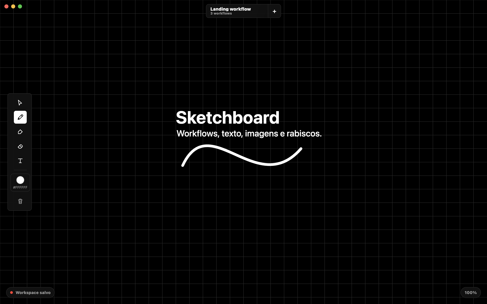

# Sketchboard

Sketchboard is a clean Electron whiteboard for drawing, placing images, editing text and organizing multiple workflow boards.



## Features

- Multiple workflow boards in the same workspace.
- Pencil, marker, eraser and text tools.
- Brush thickness and smoothing controls.
- Image paste, drag-and-drop and object manipulation.
- Auto-save workspace state.
- Export/import workflow configuration with `.sketchboard.json` files.

## Installers

The project builds these installers:

- macOS: `Sketchboard-0.1.0-arm64.dmg`
- Windows: `Sketchboard Setup 0.1.0.exe`

After running the build commands, both files are saved in `dist/`.

## Run locally

```bash
npm install
npm start
```

## Build installers

```bash
npm run dist:mac
npm run dist:win
```

Generated installers are saved in `dist/`.

## Workflow backup

Use the workflow menu inside the app to export all workflows to a `.sketchboard.json` file and import them later into another workspace.
